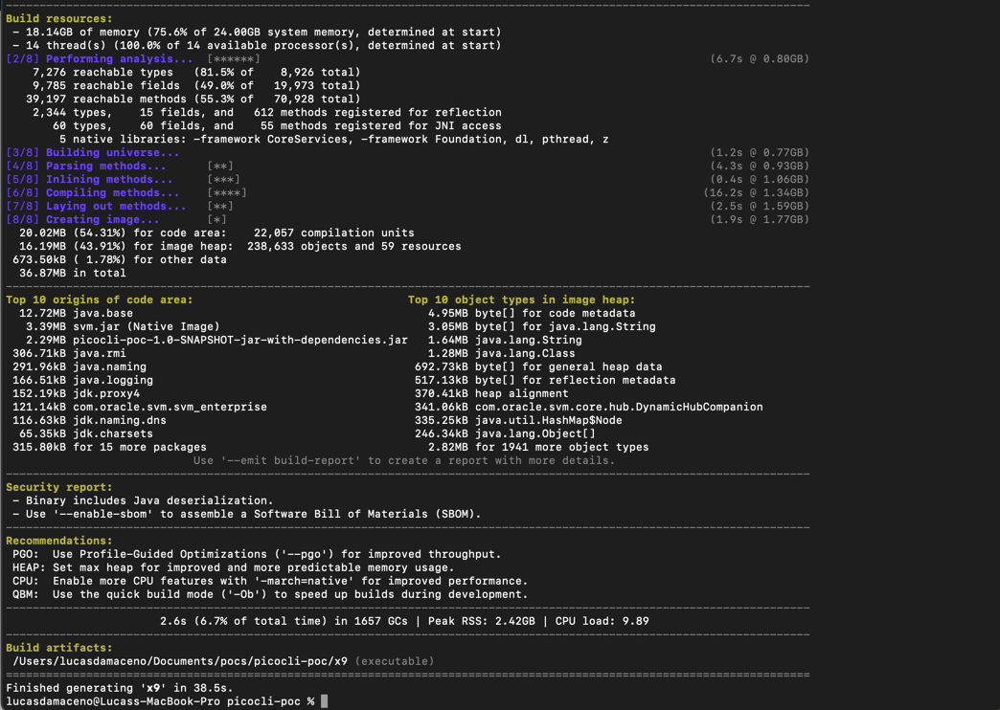

# Picocli Tools

A collection of command-line utilities built with Kotlin and Picocli.

## Tools Included

1. **Checksum Calculator** - Calculate file checksums using various algorithms
2. **x9** - GitHub activity viewer that summarizes a user's push events

## Overview

This project demonstrates how to build a command-line application using:
- Kotlin 2.1.20
- Picocli 4.7.7 for command-line argument parsing
- Java SDK 24 compatibility
- Maven for dependency management and building

## Features

- Calculate checksums using different algorithms (MD5, SHA-1, SHA-256, etc.)
- User-friendly command-line interface with help and version information
- Simple file input handling

## Prerequisites

- Java SDK 24 or later
- Maven 3.6 or later

## Building the Project

```bash
mvn clean package
```

## Building Native Image with GraalVM

To build native executables using GraalVM, you need to:

1. Install GraalVM 24.0.0 or later
2. Set JAVA_HOME to point to your GraalVM installation
3. Install the native-image component if not already installed:

```bash
$JAVA_HOME/bin/gu install native-image
```

4. Use one of the build scripts:

```bash
# Option 1: ULTRA SIMPLE implementation with no external dependencies (RECOMMENDED)
./build-ultra-simple.sh
./build-both-simple.sh

# Option 2: Basic implementation using org.json
./build-basic.sh

# Option 3: Other approaches (if the above don't work)
./build-robust.sh
./build-no-deps.sh
./build-bare-minimum.sh
./build-simple.sh
```

The simplified applications avoid using picocli completely and should build successfully with GraalVM.

**Note about the simplified versions:**
1. They don't use picocli but provide the same functionality with manual argument parsing
2. The ultra simple implementation uses only Java standard library with very basic string operations
3. Multiple implementation options are provided to work around various GraalVM limitations
4. For best results, use the ultra simple implementation which has no dependencies on external libraries

This will generate native executables in the `target` directory:
- `target/checksum` - The checksum calculator
- `target/x9` - The GitHub activity viewer

You can also build them individually using the GraalVM native-image tool directly:

```bash
# Build the project with the fat JAR
mvn clean package

# The fat JAR will be created at:
# target/picocli-poc-1.0-SNAPSHOT-jar-with-dependencies.jar

# Build native images separately
native-image --no-fallback \
  -cp target/picocli-poc-1.0-SNAPSHOT-jar-with-dependencies.jar \
  -H:ReflectionConfigurationFiles=src/main/resources/META-INF/native-image/picocli-reflect-config.json \
  --report-unsupported-elements-at-runtime \
  --allow-incomplete-classpath \
  -H:+ReportExceptionStackTraces \
  -H:Name=checksum \
  ChecksumKt

native-image --no-fallback \
  -cp target/picocli-poc-1.0-SNAPSHOT-jar-with-dependencies.jar \
  -H:ReflectionConfigurationFiles=src/main/resources/META-INF/native-image/picocli-reflect-config.json \
  --report-unsupported-elements-at-runtime \
  --allow-incomplete-classpath \
  -H:+ReportExceptionStackTraces \
  -H:Name=x9 \
  X9CliKt
```

## Running Native Executables

Once built, you can run the native executables directly:

```bash
# Run the checksum calculator
./checksum --algorithm SHA-1 hello.txt

# Run the GitHub activity viewer
./x9 octocat
```

These native executables start instantly and have no dependency on the JVM.

Native executables are much faster to start up and require no JVM to run.

## Native build


## Running the Application

### Using Maven

```bash
mvn exec:java -Dexec.args="--algorithm SHA-1 hello.txt"
```

### Using Java directly

```bash
java -classpath target/classes:$(mvn dependency:build-classpath -Dmdep.outputFile=/dev/stdout -q) ChecksumKt --algorithm SHA-1 hello.txt
```

### Manual classpath method

```
java -classpath /Users/lucasdamaceno/Documents/pocs/picocli-poc/target/classes:/Users/lucasdamaceno/.m2/repository/org/jetbrains/kotlin/kotlin-stdlib/2.1.20/kotlin-stdlib-2.1.20.jar:/Users/lucasdamaceno/.m2/repository/org/jetbrains/annotations/13.0/annotations-13.0.jar:/Users/lucasdamaceno/.m2/repository/info/picocli/picocli/4.7.7/picocli-4.7.7.jar ChecksumKt --algorithm SHA-1 hello.txt
```

## Command-Line Options

- `-a, --algorithm <ALGORITHM>` - Specify the hashing algorithm (default: SHA-256)
- `-h, --help` - Show help message and exit
- `-V, --version` - Print version information and exit

## Examples

Calculate SHA-256 checksum (default):
```bash
java -classpath ... ChecksumKt hello.txt
```

Calculate MD5 checksum:
```bash
java -classpath ... ChecksumKt --algorithm MD5 hello.txt
```

# x9 GitHub Activity Viewer

The x9 command helps you track GitHub activity for a specified user by retrieving and displaying their recent push events and commits.

## Using x9

### Running via Maven

```bash
mvn exec:java -Dexec.mainClass="X9CliKt" -Dexec.args="username"
```

### Running via Java

```bash
java -classpath target/classes:$(mvn dependency:build-classpath -Dmdep.outputFile=/dev/stdout -q) X9CliKt username
```

### Command-Line Options

- `username` - The GitHub username whose activity you want to view (required)
- `-h, --help` - Show help message and exit
- `-V, --version` - Print version information and exit

## Creating Command Aliases

### Unix/Linux/MacOS

Add the following to your `~/.bashrc`, `~/.zshrc`, or equivalent shell configuration file:

```bash
# For the Checksum command
alias checksum='java -classpath /path/to/project/target/classes:/path/to/required/jars ChecksumKt'

# For the x9 command
alias x9='java -classpath /path/to/project/target/classes:/path/to/required/jars X9CliKt'

# Native Image (after building)
alias checksum-native='./target/checksum'
alias x9-native='./target/x9cli'
```

Then reload your configuration:

```bash
source ~/.bashrc  # or ~/.zshrc
```

### Windows (PowerShell)

Add the following to your PowerShell profile:

```powershell
function checksum { java -classpath "C:\path\to\project\target\classes;C:\path\to\required\jars" ChecksumKt $args }
function x9 { java -classpath "C:\path\to\project\target\classes;C:\path\to\required\jars" X9CliKt $args }
```

### Windows (Command Prompt)

Create a batch file named `checksum.bat` and `x9.bat` in a directory that's in your PATH:

```batch
@echo off
java -classpath "C:\path\to\project\target\classes;C:\path\to\required\jars" ChecksumKt %*
```

```batch
@echo off
java -classpath "C:\path\to\project\target\classes;C:\path\to\required\jars" X9CliKt %*
```

## Examples

View GitHub activity for a user:
```bash
x9 octocat
```

## License

This project is available under the MIT License.